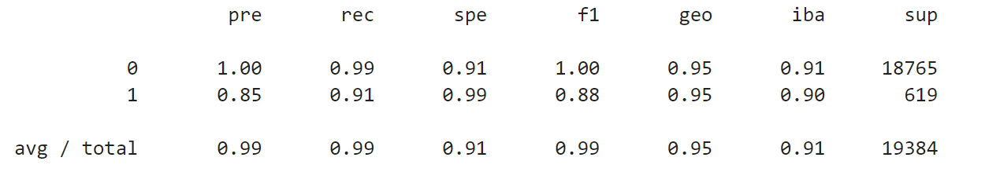
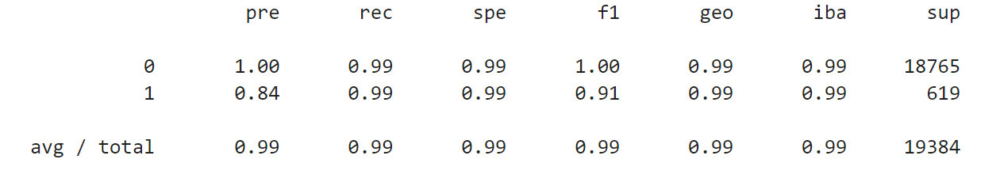

# Credit Risk Analysis Report

## Overview of the Analysis

The purpose of the credit risk analysis is to use various techniques to train and evaluate models with imbalanced classes. Credit risk poses a classification problem as healthy loans outnumber risky loans. The financial information used is a dataset of historical lending activity from a peer-to-peer lending services company which is comprised of the following data: loan_size, interest_rate, borrower_income, debt_to_income, num_of_accounts, derogatory_marks, total_debt, and loan_status. Using this information, we need to predict the creditworthiness of its borrowers and more importantly, the risk of default (otherwise known as 'y'). Using the value_counts function for y, we can see there are 75,036 healthy loans (classified as '0') and 2,500 high risk loans (classified as '1') and thus creating a large imbalance in the data. As a result, in order to more accurately predict 'y', two LogisticRegression models were created, fitted, and predicted on using the original data and resampled data, respectively. (Note, the RandomOverSampler module from the imbalanced-learn library was used on the original data to generate the resampled data.) A balanced accuracy score and classification report are then generated for both models to determine which model is better at predicting y.

___
## Results

* Machine Learning Model 1 (Original Data):
  * Balanced Accuracy Score: 95.2% 
  * Precision Score:
    0 - Healthy : 100%
    1 - Unhealthy: 85%
  * Recall Scores:
    0 - Healthy : 99%
    1 - Unhealthy: 91%

* Machine Learning Model 2 (Resampled Data):
  * Balanced Accuracy Score: 99.4%
  * Precision Score:
    0 - Healthy : 100%
    1 - Unhealthy: 84%
  * Recall Scores:
    0 - Healthy : 99%
    1 - Unhealthy: 99%
  * Recall Score:

___
## Summary

In summary, the precision with the resampled data is lower than the original data. The original data was better at detecting high risk loans. However, the resampled data correctly classified a higher percentage of truly high risk loans. Overall, the model using resampled data was much better at detecting loans at risk for default which is of higher importance. Further, the balanced accuracy score of the resampled data was 99.4% which was an improvement from the original score of 95.2%. Therefore, it is recommended to use the Logistical Regression model using the resampled data.

